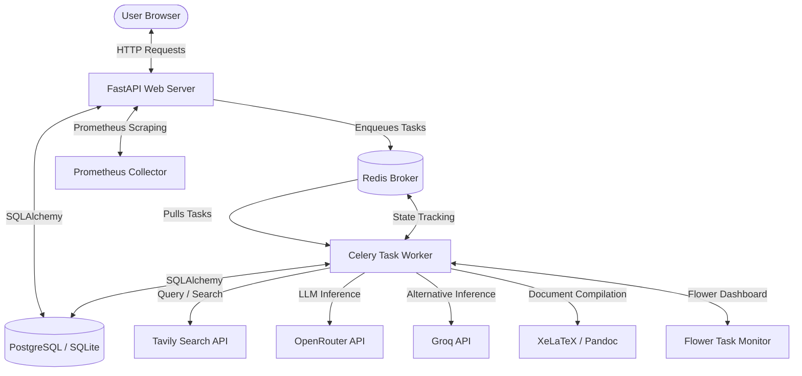

# ScholarForge: High-Level Introduction and System Architecture

Hey there! Welcome to the detailed, step-by-step walkthrough of **ScholarForge**. This guide is written by a developer, for developers. We're going to dive deep into every single directory, file, and line of architectural logic in the codebase. No abstractions, no hand-waving—just the cold, hard, and elegant facts of how this platform is built.

---

## What is ScholarForge?

At its core, **ScholarForge** is an advanced, AI-powered academic and technical research assistant. It's designed to solve a very specific problem: **how to generate high-quality, long-form, facts-verified reports that actually sound human, rather than generic AI summaries.**

If you've ever asked standard models like ChatGPT or Claude to write a 15-page report, you know they tend to summarize aggressively, hallucinate statistics, skip citations, or fail to follow rigorous layout formatting. ScholarForge addresses this by splitting the writing process into multiple layers:
1. **Dynamic Information Gathering**: Synthesizing web searches (via Tavily) and local file contents (PDF, DOCX, TXT, MD).
2. **Context-Aware Outline Planning**: Breaking down the writing task into distinct, logical sections based on templates.
3. **Multi-Agent Editorial Council**: A custom consensus-driven agent loop (Legion, Nexus, Inquisitor, and Artisan) that drafts, critiques, fact-checks, and refines each section recursively before compiling the final document.
4. **Document Export Pipeline**: Converting the finalized markdown into professional formats like PDF, DOCX, MD, TXT, and JSON, featuring auto-generated statistical charts.

---

## High-Level Architecture

The platform is designed around a modern, asynchronous service architecture. Heavy processing jobs (like querying search engines, reading documents, and running the agent council loop) are offloaded to background workers.

Here is how the services are arranged:

### Components Breakdown:
1. **FastAPI Web Server (`backend/main.py`)**: The primary gateway. It serves the HTML UI pages (via Jinja2), handles user API requests, manages stateful chat sessions, processes file uploads, and initiates background tasks.
2. **PostgreSQL / SQLite Database (`backend/database.py`)**: The persistence layer. It stores chat sessions, message histories, research hooks, and completed report contents. It supports dynamic pooling to accommodate either developer-friendly local file databases (SQLite) or production cloud setups (Postgres).
3. **Redis Broker**: A fast in-memory database that serves as the message broker for Celery and the backend state storage.
4. **Celery Worker (`backend/task.py`)**: The heavy lifter. The web server must return HTTP responses within milliseconds to keep the UI snappy. Generating reports can take minutes, so FastAPI kicks off Celery tasks. The worker does the actual research, triggers the LLM Council, compiles the text, renders the graphs, and saves the final result.
5. **OpenRouter & Groq APIs**: Used for model querying. To avoid single-point failure, the system uses fallback models. If Gemini fails, it routes to Llama variants or Nemotron seamlessly.
6. **Pandoc & XeLaTeX**: Native operating system tools invoked to convert markdown text into beautifully typeset DOCX and PDF documents.

---

## Folder Structure Mapping

To navigate the project easily, here is a breakdown of the repository layout:

* **`backend/`**: The core Python backend service.
  * `main.py`: FastAPI application setup, middleware definitions, and HTTP routes.
  * `database.py`: SQLAlchemy schemas, database connection engine, pooling configuration, and CRUD logic.
  * `AI_engine.py`: Central report generation orchestrator. Manages web searches, text summaries, layout outlines, and file conversion hooks.
  * `chat_engine.py`: Manages the conversational agent assistant prompts, model routing, and history formatting.
  * `council.py`: The orchestrator for the Agent Council consensus loop.
  * `report_formats.py`: Pre-configured structure rules for different document formats (e.g., Literature Reviews, Case Studies, White Papers).
  * `task.py`: Celery app initialization and background task worker functions.
  * `logging_config.py`: Structured JSON logging setup to facilitate cloud observability.
  * **`agents/`**: Core agents making up the Council.
    * `legion.py`: Spawns multiple parallel models to write draft proposals.
    * `nexus.py`: Synthesizes multiple drafts into a single master draft.
    * `inquisitor.py`: Critiques drafts and triggers recursive web searches for fact-checking.
    * `artisan.py`: Refines flow, fixes grammar, and implements Inquisitor critiques.
    * `tools.py`: Helper functions for agents (like Tavily search integrations).
    * `utils.py`: Async helpers to hit APIs with rate-limit retries.
* **`frontend/`**: The presentation layer.
  * **`templates/`**: Jinja2 HTML templates.
    * `layout.html`: Base dashboard wrapper (navigation, styling links, layout core).
    * `report_generator.html`: The UI for starting reports, tracking task progress, and viewing results.
    * `ai_assistant.html`: The interactive chat assistant layout, supporting folders and files.
    * `search.html`: Specialized research utility window.
  * **`static/`**: Tailwind-compiled stylesheets, javascript interactive scripts, and generated graphics.
* **`alembic/`**: Database migrations folders for SQLAlchemy schema tracking.
* **`tests/`**: Test suite containing conftest configurations and unit/integration files.
* **`src/`**: Legacy placeholder directories containing CrewAI files (mostly unused now, replaced by the custom council architecture under `backend/agents/`).

Now that you have the big picture, let's dive into **Chapter 2: Backend API and Routing** to see how FastAPI receives requests and drives the application flow.
